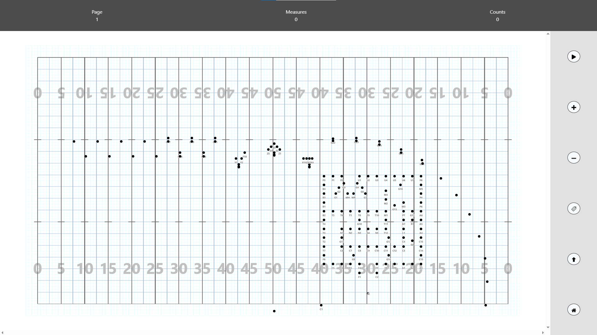
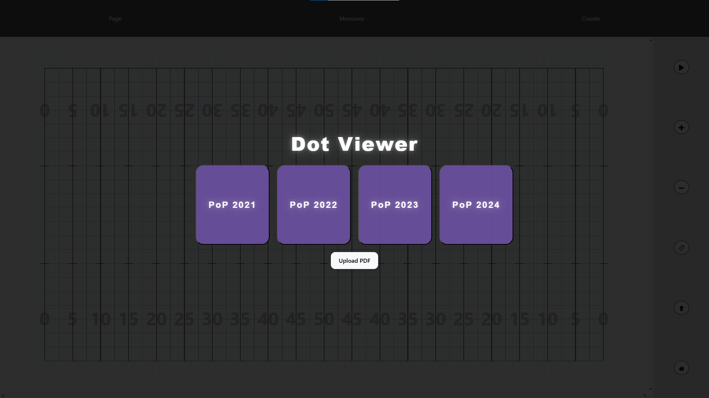
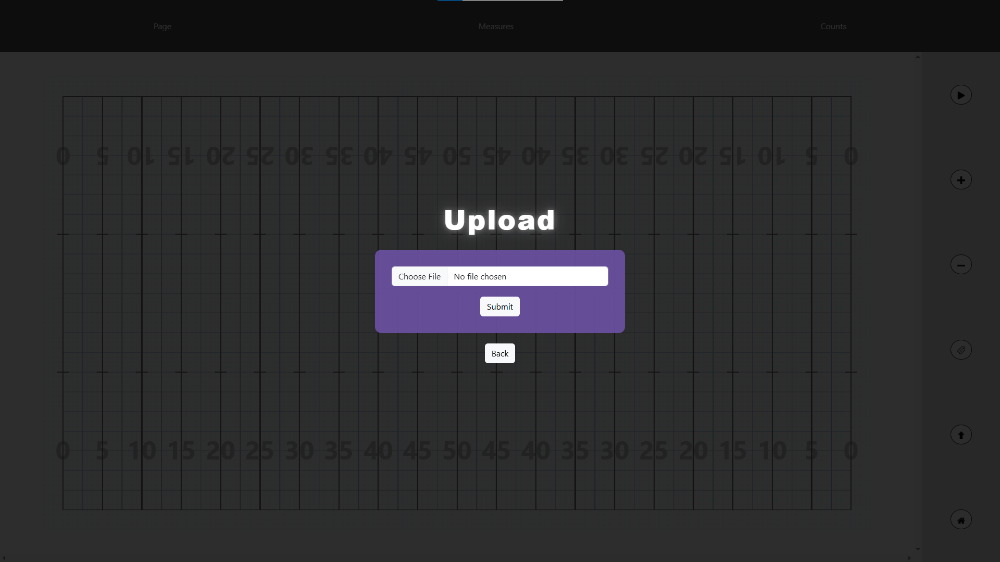

# Dot Viewer

A Marching Band visualizer web application inspired by UDB. Displays a dynamic digital football field that visualizes dot sheet PDFs in sync with music, allowing users to flip through drill sets and animate movements.

## Built With

- Python / Flask (PDF processing)
- D3.js (visualizations)
- HTML5
- CSS3